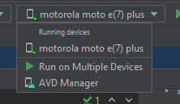

# LABORATORIO 11 IETI

Una vez creada la app mostramos la estructura del proyecto.

Configuramos nuestro dispositivo para correr la aplicación.

En android studio seleccionamos nuestros dispositivo.

En nuestro dispositivo deberíamos ver la aplicación funcionando.

Una vez creamos el texto y el botón podemos volver a correr la app y ver el resultado.

Creamos las transiciones y las probamos en nuestro dispositivo.

#### AUTOR
- David Alejandro Vasquez Carreño